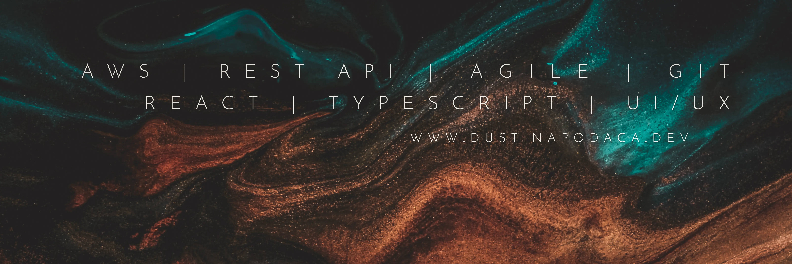

<pre style="font-family:Andale Mono">
Hey there, 🌱
</pre>

---
<!-- 

  <pre style="font-family:Andale Mono;overflow-wrap:break-word;overflow-x: auto;"> -->
I'm Dustin! I'm a passionate advocate for expressing creative energy and finding your flow through all facets of design. Whether that be an efficiently structured and  and someone who’s been there and back again in my personal journey- seeing what works in life and what doesn’t.
    <!--   -->
    
I'm a Full-Stack Engineer && Designer with a focus on developing applications and technologies using TypeScript, React, and React-Native. My passion lies in ensuring that applications are not only efficient- but creative and beautifully designed.
  <!-- </pre>

 -->
---

  
  
  
  
  
  
  
  
  
  
  
  
  
  
  
  
  
  
  
  
  
  
  
  
  
  
  
  
  
  
  
  
  
  
  
  
  
   
   
  
  
  
  
  
  
  
  
  
  
  
  
  

---